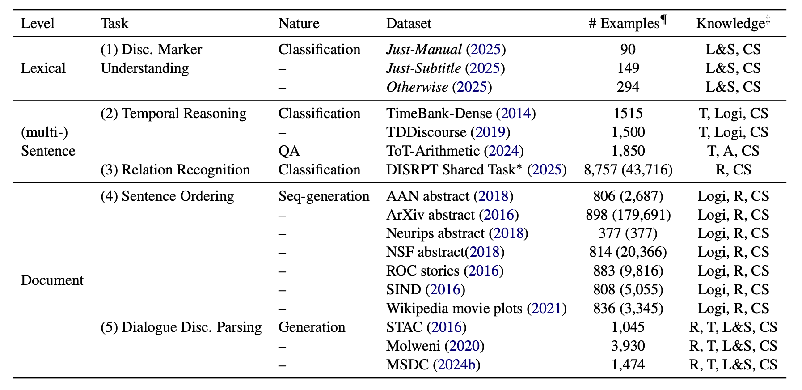

# BeDiscovER

Code and datasets for the paper *The Benchmark of Discourse Understanding in the Era of Reasoning Language Models* (EACL 2026).
- Paper: https://aclanthology.org/2026.eacl-long.207/
- Slides: https://chuyuanli.github.io/assets/files/paper/26eacl_bediscover_v2.pdf


<br>


## Overview

BeDiscovER is a benchmark for discourse understanding across five tasks:

- `ddp`: dialogue discourse parsing
- `dm`: discourse marker understanding
- `dr`: discourse relation recognition
- `so`: sentence ordering
- `tr`: temporal reasoning

This repository provides the processed evaluation data used in the paper, along with a lightweight loader script for accessing each task in a consistent format.

## Repository Structure

```text
.
├── data/
│   ├── ddp/
│   ├── dm/
│   ├── dr/
│   ├── so/
│   └── tr/
├── load_data.py
└── README.md
```

Each task directory contains its own `README.md` with dataset-specific details, sources, and preprocessing notes.

## Loading the Data

Use `load_data.py` to load the processed test sets.

```bash
python load_data.py --task dm --dataset_names just otherwise --dataset_fracs 1.0 1.0 --split test
python load_data.py --task tr --dataset_names tbd-ee tdd-man tot-arithmetic --dataset_fracs 1.0 1.0 1.0 --split test
python load_data.py --task dr --dataset_names disrpt25 --dataset_fracs 0.2 --split test
python load_data.py --task so --dataset_names aan-abstract arxiv-abstracts nips-abs nsf roc sind-captions wiki-movies --dataset_fracs 0.3 0.05 1.0 0.08 0.09 0.16 0.25 --split test
python load_data.py --task ddp --dataset_names stac molweni msdc --dataset_fracs 1.0 1.0 1.0 --split test
```

Notes:

- For `so`, data is stored in `.jsonl` format.
- For `tr`, `dm`, and `ddp`, data is stored in `.json` format.
- For `dr`, the loader reads processed DISRPT 2025 data from `data/dr/disrpt25/`. When loading `dr` with `--dataset_names disrpt25`, the script expands this to all supported DISRPT test sets automatically.

## Task Directories

- [data/ddp/README.md](data/ddp/README.md): dialogue discourse parsing
- [data/dm/README.md](data/dm/README.md): discourse marker understanding
- [data/dr/README.md](data/dr/README.md): discourse relation recognition
- [data/so/README.md](data/so/README.md): sentence ordering
- [data/tr/README.md](data/tr/README.md): temporal reasoning

## Data Availability

Some source datasets have their own redistribution constraints. See the task-specific READMEs for details, especially [data/dr/README.md](data/dr/README.md) for DISRPT datasets that cannot be redistributed directly.


[TODO] We also plan to mirror the benchmark datasets on Hugging Face shortly. 


## Citation
Please kindly cite our research if you use this benchmark:

```
@inproceedings{li-carenini-2026-bediscover,
    title = "{B}e{D}iscov{ER}: The Benchmark of Discourse Understanding in the Era of Reasoning Language Models",
    author = "Li, Chuyuan  and
      Carenini, Giuseppe",
    editor = "Demberg, Vera  and
      Inui, Kentaro  and
      Marquez, Llu{\'i}s",
    booktitle = "Proceedings of the 19th Conference of the {E}uropean Chapter of the {A}ssociation for {C}omputational {L}inguistics (Volume 1: Long Papers)",
    month = mar,
    year = "2026",
    address = "Rabat, Morocco",
    publisher = "Association for Computational Linguistics",
    url = "https://aclanthology.org/2026.eacl-long.207/",
    doi = "10.18653/v1/2026.eacl-long.207",
    pages = "4417--4479",
    ISBN = "979-8-89176-380-7"
}
```

